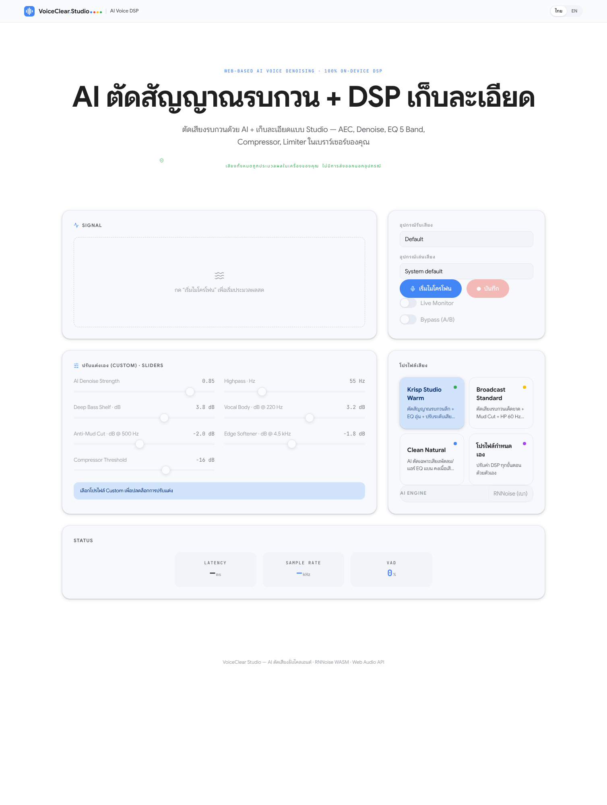

# VoiceClear Studio 🎙️

**Web-Based AI Voice Denoising & DSP Platform** — client-side real-time speech processing.
เสียงทั้งหมดประมวลผลในเครื่องผู้ใช้ 100% ไม่มีข้อมูลออกนอกอุปกรณ์

  



## Missions

1. **AEC** — Acoustic Echo Cancellation (browser-native via getUserMedia constraints)
2. **AI Noise Suppression** — RNNoise compiled to WASM, running inside an AudioWorklet
   (frame 480 samples @ 48 kHz ≈ 10 ms, VAD-gated output)
3. **Studio DSP Mastering Chain** — HP 55 Hz → Deep Bass Shelf → Vocal Body → Anti-Mud Cut → Edge Softener → Compressor → tanh soft-clip limiter @ −1.5 dBFS

## Features

- Live mic processing with input/output device selection (`setSinkId`)
- **Live Monitor** toggle + **Bypass A/B** switch (raw vs processed)
- Record processed audio → export **48 kHz / 24-bit WAV**
- Real-time Spectrogram / Oscilloscope / Peak VU meter (Canvas)
- Presets: Krisp Studio Warm · Broadcast Standard · Clean Natural · Custom (full parametric control)
- TH/EN bilingual UI
- Latency target ≤ 20 ms (one 10 ms RNNoise frame + context latency)

## Run

```bash
bun install
bun run dev      # http://localhost:5173
bun run test     # vitest unit tests
bun run build    # static build → dist/
```

> Microphone requires a secure context: `localhost` or HTTPS.

## Deploy (Cloudflare Pages)

```bash
bun run build
npx wrangler pages deploy dist --project-name voiceclear-studio
```

Static hosting only — zero server cost, no backend.

## Architecture

```
getUserMedia(AEC on, AGC off) → MediaStreamSource
  → AudioWorklet [RNNoise WASM · frame 480]   ← wasm binary passed via port
  → Biquad HP 55 Hz → lowshelf 130 Hz +3.8 dB → peaking 220 Hz +3.2 dB
  → peaking 500 Hz −2 dB → peaking 4.5 kHz −1.8 dB
  → DynamicsCompressor −16 dB / 2.5 : 1 / 15 ms / 100 ms
  → WaveShaper soft-clip (tanh, 4× oversampled) → Gain −1.5 dBFS ceiling
  ├→ Monitor gain → destination (setSinkId)
  ├→ pcm-tap worklet → WAV recorder (24-bit)
  └→ AnalyserNodes → spectrogram · scope · VU meter
```

The denoiser sits behind a small `Denoiser` interface (`src/audio/denoiser.ts`) —
DeepFilterNet WASM is planned as a second selectable engine (phase 2), together
with offline file denoising via OfflineAudioContext (v1.1).

## Spec & Plan

- [Design spec](docs/specs/2026-02-05-voiceclear-studio-design.md)
- [Implementation plan](docs/plans/2026-02-05-voiceclear-studio.md)
